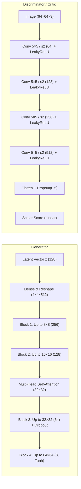

# DCGAN-s: Self-Attention WGAN-GP for Face Generation

[](https://www.python.org/downloads/)
[](https://tensorflow.org)
[](LICENSE)

A clean, modular implementation of **Wasserstein GAN with Gradient Penalty (WGAN-GP)** enhanced with **Multi-Head Self-Attention** for high-fidelity 64×64 face synthesis on the CelebA dataset.

This repository compares two upsampling paradigms:
1. **Nearest-Neighbor UpSampling2D + Conv2D** (to eliminate checkerboard deconvolution artifacts).
2. **Standard Conv2DTranspose** (fractionally strided convolutions).

---

## 🌟 Key Highlights

- **WGAN-GP Objective**: Enforces 1-Lipschitz continuity via an explicit gradient penalty on interpolated points ($\lambda = 10.0$), preventing mode collapse and gradient vanishing.
- **Self-Attention Mechanism**: Integrated `MultiHeadAttention` at the 32×32 feature map scale, capturing long-range global facial dependencies (e.g., symmetric eyes, jawline alignment).
- **Artifact Reduction**: Implementation of `UpSampling2D` + `Conv2D` that prevents the high-frequency checkerboard artifacts commonly induced by strided transposed convolutions.
- **Stabilization Techniques**: Dynamic instance noise injected into the discriminator inputs during early iterations to avoid early discriminator domination.
- **Evaluation Pipeline**: Built-in calculation of **Fréchet Inception Distance (FID)** and **Inception Score (IS)** via pre-trained InceptionV3.

---

## 🏗️ Architecture Overview



---

## 🔬 Deconvolution vs. UpSampling2D

| Approach | Architecture | Advantage | Disadvantage |
| :--- | :--- | :--- | :--- |
| **UpSampling2D + Conv2D** *(Default)* | `UpSampling2D(nearest)` $\to$ `Conv2D` | **No checkerboard artifacts**; smooth gradient propagation across spatial features. | Slightly higher parameter count in separate layers. |
| **Conv2DTranspose** | `Conv2DTranspose(strides=2)` | Single fused operation; standard DCGAN baseline. | Prone to uneven kernel overlap producing grid/checkerboard artifacts. |

---

## 📁 Repository Structure

```
DCGAN-s/
├── models.py                  # Generator, Critic, WGAN-GP model, Callbacks & LR Scheduler
├── dataset.py                 # Preprocessing, normalization [-1, 1], directory flow iterator
├── metrics.py                 # Quantitative metrics: FID & Inception Score (InceptionV3)
├── train.py                   # Command-line training interface
├── generate.py                # Inference & latent walk interpolation script
├── notebooks/
│   ├── wgan_gp_upsampling.ipynb         # UpSampling2D interactive notebook
│   └── wgan_gp_conv2d_transpose.ipynb   # Conv2DTranspose interactive notebook
├── requirements.txt           # Python dependencies
├── .gitignore                 # Checkpoints, logs, output artifacts
├── LICENSE                    # MIT License
└── README.md                  # Project documentation
```

---

## 🚀 Quick Start

### 1. Installation

Clone this repository and install the dependencies:

```bash
git clone https://github.com/HemanthMuthyamDevareddy/DCGAN-s.git
cd DCGAN-s
pip install -r requirements.txt
```

### 2. Training

Train the WGAN-GP model on your image dataset:

```bash
python train.py --data_dir "path/to/celeba_dataset" --mode upsample --epochs 30 --batch_size 128
```

Key arguments:
- `--mode`: Choose `upsample` (UpSampling2D + Conv2D) or `transpose` (Conv2DTranspose).
- `--data_dir`: Root folder containing image files or image class folders.
- `--out_dir`: Directory to store generated sample grids (`results/`), checkpoints (`models/`), and animated training GIF.
- `--resume_gen` / `--resume_disc`: Paths to pre-trained weights (`.h5`) to continue training.

### 3. Image Generation & Latent Walk

Generate a grid of synthetic faces:
```bash
python generate.py --weights "runs/01_wgan_gp/results/models/gen_029.h5" --num_samples 16 --out_dir "outputs"
```

Create a smooth **latent space interpolation GIF**:
```bash
python generate.py --weights "runs/01_wgan_gp/results/models/gen_029.h5" --interpolate --steps 60 --out_dir "outputs"
```

---

## 📊 Quantitative Evaluation (FID & IS)

Evaluate image fidelity using Fréchet Inception Distance (FID) and Inception Score (IS):

```python
from models import build_generator
from dataset import get_data_generator, extract_real_images
from metrics import GANMetrics, generate_fake_images

# 1. Load generator & real data
gen = build_generator(noise_dim=128, upsampling="upsample")
gen.load_weights("path/to/gen_checkpoint.h5")

train_gen = get_data_generator(data_dir="path/to/celeba", batch_size=128)
real_images = extract_real_images(train_gen, num_samples=5000)
fake_images = generate_fake_images(gen, noise_dim=128, num_samples=5000)

# 2. Compute metrics
metrics = GANMetrics()
fid = metrics.calculate_fid(real_images, fake_images)
is_mean, is_std = metrics.calculate_inception_score(fake_images)

print(f"FID Score: {fid:.2f}")
print(f"Inception Score: {is_mean:.2f} ± {is_std:.2f}")
```

---

## 📐 Mathematical Formulation

### Wasserstein Loss with Gradient Penalty
$$\min_G \max_{D \in \mathcal{D}} \underset{x \sim \mathbb{P}_r}{\mathbb{E}}[D(x)] - \underset{\tilde{x} \sim \mathbb{P}_g}{\mathbb{E}}[D(\tilde{x})] - \lambda \underset{\hat{x} \sim \mathbb{P}_{\hat{x}}}{\mathbb{E}} \left[ \left( \|\nabla_{\hat{x}} D(\hat{x})\|_2 - 1 \right)^2 \right]$$

Where:
- $\mathbb{P}_r$ is the real data distribution, $\mathbb{P}_g$ is the generator distribution $\tilde{x} = G(z)$.
- $\hat{x} = \epsilon x + (1 - \epsilon)\tilde{x}$ for $\epsilon \sim U(0, 1)$ defines the straight-line interpolation between real and synthetic samples.
- $\lambda = 10.0$ balances the Wasserstein critic maximization and the 1-Lipschitz penalty constraint.

---

## 📜 License

This project is licensed under the MIT License - see the [LICENSE](LICENSE) file for details.